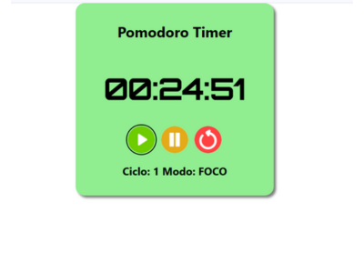

# ⏱️ Pomodoro Timer - Sistema de Estudos com Metodologias Ágeis

Este é um aplicativo web para auxiliar nos estudos utilizando o **método Pomodoro**, com controle de tempo, ciclos de foco e descanso, inspirado também em técnicas como **Focus Tree** e **Sistema Leitner**.
Este projeto nasceu da necessidade de eu empregar métodos conhecidos à minha rotina de estudo para melhorar a aprendizagem de forma eficiente.
Diante dessa necessidade, esse projeto foi idealizado também para praticar conceitos reais de desenvolvimento e organização ágil de projetos.

---

## ✅ Funcionalidades atuais

- ⏱️ Timer com tempo de foco (25 min) e pausa (5 min)
- 🔁 Alternância automática entre ciclos de foco e pausa
- 🔔 Alerta sonoro ao final de cada período
- 🔄 Exibição do ciclo atual e modo ativo (FOCO ou PAUSA)
- 🎨 Interface visual responsiva e agradável
- ♿️ Melhorias de acessibilidade com foco em conformidade com WCAG
- 📱 Compatível com dispositivos móveis

---

## 🧪 Exemplo da Interface

---

## 🚧 Próximas melhorias (Backlog)

- 📊 Estatísticas de produtividade por sessão e por dia
- 🌙 Modo escuro (Dark Mode)
- 🔄 Contador de ciclos completados
- 📚 Integração com Sistema Leitner para revisão espaçada
- ☁️ Hospedagem online (GitHub Pages ou Vercel)

---

## 🚀 Tecnologias Utilizadas

- HTML5
- CSS3
- JavaScript (ES6+)

---

## ▶️ Como usar

1. Clone o repositório:
2. Acesse a pasta do projeto:
3. Abra o arquivo `index.html` no seu navegador.

✅ Pronto! O timer já está funcionando.

---

## 📅 Organização do Projeto

Este projeto está sendo desenvolvido em **sprints** com metodologia ágil, utilizando recursos do GitHub:

- **Milestones** para definir cada sprint
- **Issues** para listar e acompanhar as tarefas
- **GitHub Projects (Kanban)** para visualizar o progresso

Atualmente estamos na **Sprint 0: Preparação do Projeto**.

---

## 📝 Licença

Este projeto está licenciado sob a **Licença MIT**.  
Sinta-se à vontade para usar, modificar e contribuir!

---

## 🙋‍♂️ Autor

Desenvolvido por **[FelipeReisCabral]**  
🔗 [[Meu LinkedIn](https://www.linkedin.com/in/felipe-reis-cabral/)]  
🔗 [[Meu GitHub](https://github.com/FelipeReisCabral)]

---
